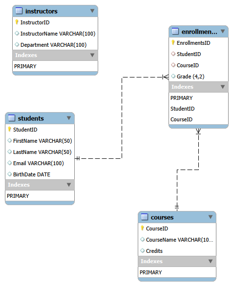
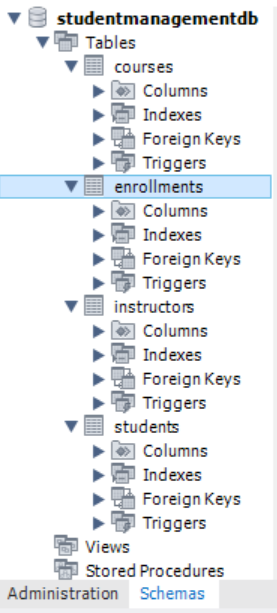
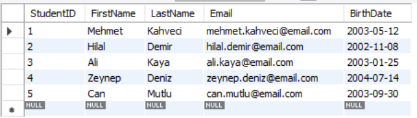
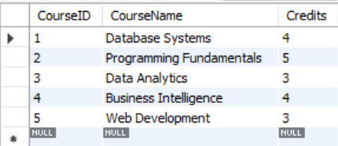
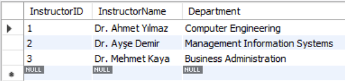
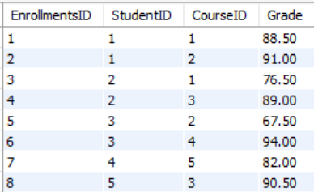
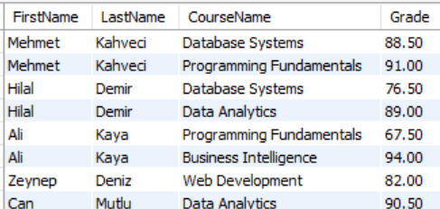
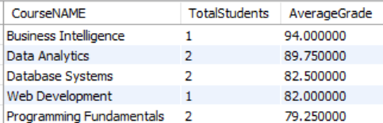

# 🎓 SQL Student Management Database

A relational database project developed with **MySQL** to simulate a university Student Management System.

This project demonstrates SQL fundamentals and intermediate database concepts, including relational database design, data manipulation, aggregation, and table relationships.

---

# 📌 Project Overview

The database manages:

- Students
- Courses
- Instructors
- Enrollments

It demonstrates how relational databases are designed, populated, and queried using SQL.

---

# 🛠️ Technologies Used

- MySQL 8.0
- MySQL Workbench
- SQL

---

# 📂 Database Structure

The project contains four related tables:

| Table | Description |
|-------|-------------|
| Students | Stores student information |
| Courses | Stores course details |
| Instructors | Stores instructor information |
| Enrollments | Connects students and courses while storing grades |

Relationships are implemented using **Primary Keys** and **Foreign Keys** to ensure data integrity.

---

# 🚀 Features

- Relational database design
- Data insertion using SQL
- Data filtering and sorting
- Aggregate calculations
- Grouping and summarizing data
- SQL JOIN operations
- SQL Views
- Realistic university management scenario

---

# 📚 SQL Topics Covered

- CREATE DATABASE
- CREATE TABLE
- PRIMARY KEY
- FOREIGN KEY
- INSERT INTO
- SELECT
- WHERE
- ORDER BY
- GROUP BY
- HAVING
- COUNT()
- SUM()
- AVG()
- MIN()
- MAX()
- INNER JOIN
- LEFT JOIN
- DISTINCT
- LIKE
- BETWEEN
- IN
- LIMIT
- CASE
- Subqueries
- VIEW

---

# 📁 Project Structure

```
SQL-Student-Management-System
│
├── 01_database.sql
├── 02_insert_data.sql
├── 03_queries.sql
├── README.md
├── ERD.png
└── screenshots/
```

---

# 🗺️ Entity Relationship Diagram



---

# 📊 Sample Query

```sql
SELECT
    s.FirstName,
    s.LastName,
    c.CourseName,
    e.Grade
FROM Students s
INNER JOIN Enrollments e
ON s.StudentID = e.StudentID
INNER JOIN Courses c
ON e.CourseID = c.CourseID;
```

This query displays each student's enrolled courses together with their grades by joining multiple related tables.

---

# 📸 Screenshots

### Database Schema



### Students Table



### Courses Table



### Instructors Table



### Enrollments Table



### JOIN Query Result



### Final Report Query



---

# 🎯 Learning Outcomes

Through this project, I gained practical experience in:

- Designing relational databases
- Writing SQL queries
- Working with Primary and Foreign Keys
- Creating table relationships
- Performing data analysis using SQL
- Using aggregate functions and JOIN operations

---

# 👨‍💻 Author

**Mehmet Erdoğan Mutlu**

Management Information Systems (MIS) Student

Istanbul Nisantasi University

Interested in Data Analytics, Business Intelligence, SQL, Python, and Power BI.

- GitHub: *(https://github.com/Woxnkr)*
- LinkedIn: *(https://www.linkedin.com/in/mehmet-erdoğan-mutlu-47a4b1293/)*

---

# ⭐ Future Improvements

- Implement stored procedures
- Add database triggers
- Optimize queries using indexes
- Expand the database with departments and semesters
- Develop a Power BI dashboard connected to the database